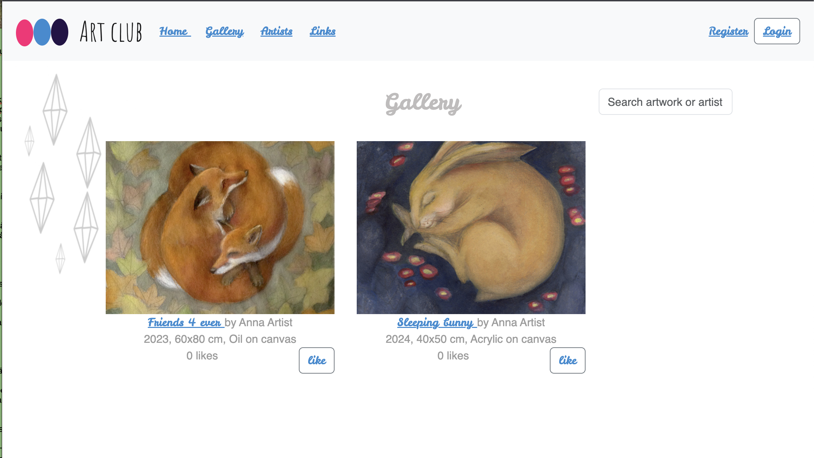
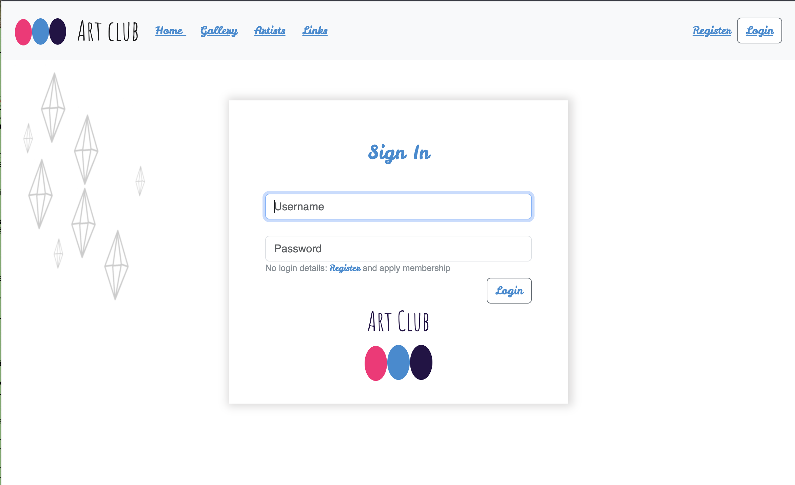
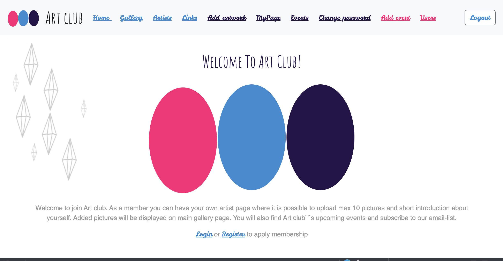

# ArtClub — Full Stack Web Application

[](https://github.com/vsvala/Art_Club/actions/workflows/ci.yml)

🚧 Actively developed full-stack personal project (ongoing development)


A full stack web application for an art club, where users can browse artists and artworks, apply for membership, and manage their own profile and gallery. Originally built as an independent 10 ECTS project for the University of Helsinki's Full Stack Open program, this application has since been revived, updated, and continued as an ongoing personal hobby project.

## What This Project Demonstrates

- End-to-end feature delivery across frontend, backend integration, and production deployment
- Role-based access control (visitor/member/admin) with protected routing and JWT session flow
- Production-oriented workflow with CI/CD, Docker image publishing, and automated deployment pipeline
- Practical API integrations (Cloudinary image storage and Open-Meteo weather data)

> **[Live demo →](https://artclub-q41z.onrender.com/)**

### Demo access

Demo credentials are available on request for recruiters and reviewers. Please contact me by email for access details.

**Backend repository:** [Art_Club_back](https://github.com/vsvala/Art_Club_back)

---

## Features

**For visitors**

- Browse artists and their artwork galleries
- Search and filter artworks
- View links to exhibitions and current painting weather for any city
- Apply for club membership

**For members**

- Create and update a personal profile page with a short introduction
- Upload up to 10 images to a personal gallery
- View all member artwork in the main gallery
- Like artworks and see the 10 most liked paintings
- View club events

**For admins**

- List registered users and approve memberships
- Create and manage club events

---

## Tech Stack

| Layer         | Technologies                                                            |
| ------------- | ----------------------------------------------------------------------- |
| Frontend      | React 18, Redux, TanStack React Query, React Router v6, React Bootstrap |
| Backend       | Node.js, Express, REST API, express-validator                           |
| Database      | MongoDB, MongoDB Atlas                                                  |
| Image storage | Cloudinary                                                              |
| Auth          | JWT (JSON Web Tokens), bcrypt                                           |
| Testing       | Jest, React Testing Library, Playwright                                 |
| Weather API   | Open-Meteo (no API key required)                                        |

---

## Screenshots







---

## Getting Started

### Prerequisites

- Node.js (v16+)
- A running instance of the [backend](https://github.com/vsvala/Art_Club_back)
- MongoDB Atlas connection string
- Cloudinary account for image uploads

### Installation

```bash
git clone https://github.com/vsvala/Art_Club.git
cd Art_Club
npm install
```

Create a `.env` file in the project root:

```
REACT_APP_BACKEND_URL=http://localhost:3001
```

### Running locally

```bash
npm run dev
```

Opens at [http://localhost:3000](http://localhost:3000). The frontend proxies API requests to `http://localhost:3001` by default.

---

## Available Scripts

```bash
npm run dev             # Start development server
npm run build           # Build for production
npm test                # Run unit and integration tests
npm run test-coverage   # Run tests with coverage report
npm run test-e2e        # Run Playwright E2E tests
npm run test-e2e:report # Open last Playwright test report
npm run lint            # Check code style with ESLint
```

Current automated test scope includes unit, integration, and Playwright E2E smoke tests. E2E tests run in a separate CI workflow ([playwright.yml](.github/workflows/playwright.yml)).

---

## Architecture

### Application structure

```
Browser (React SPA)
       │
       │  HTTP / REST
       ▼
Express REST API (Node.js)
       │
       ├── MongoDB Atlas  (user & artwork data)
       └── Cloudinary     (image storage)
```

The frontend is a single-page application that communicates with the backend exclusively via a REST API. Images are uploaded directly to Cloudinary; only the image URLs are stored in MongoDB.

State management is split by concern: **Redux** manages UI and session state (logged-in user, filter input, notifications, events), while **TanStack React Query** handles server state for individual artwork and event data. The main artwork gallery uses a custom infinite scroll implementation built on the browser's **Intersection Observer API**, fetching 10 artworks per page as the user scrolls.

### Authentication & authorization

1. User submits credentials → backend validates and returns a **JWT token**
2. Token is stored in the browser's `localStorage`
3. On every page load the token is re-validated against the backend (`/api/tokenCheck`) to confirm it is still valid
4. The token payload carries the user's **role** (`member` / `admin`), which controls access to protected routes on both frontend and backend
5. Protected frontend routes use a `PrivateRoute` component that redirects unauthenticated or unauthorized users

**User roles**

| Role    | Access                                                 |
| ------- | ------------------------------------------------------ |
| Visitor | Public pages, membership application                   |
| Member  | Own profile & gallery, events, artwork likes           |
| Admin   | All member data, membership approval, event management |

---

## Project Structure

This is a **frontend-only repository**. The backend lives in [Art_Club_back](https://github.com/vsvala/Art_Club_back).

```
src/
├── components/
│   ├── artwork/    # Artwork list, single view, add/delete forms
│   ├── artist/     # Artist list and profile views
│   ├── user/       # Member profile, update and password forms
│   ├── event/      # Event list and creation form
│   ├── login/      # Login and registration forms
│   └── common/     # Shared UI: AppNavigation, notifications, GDPR, PrivateRoute, DeleteButton
├── reducers/
│   ├── store.js              # Redux store with combined reducers
│   ├── artworkReducer.js     # Artwork state (including single artwork)
│   ├── userReducer.js        # User/member state
│   ├── eventReducer.js       # Event state
│   ├── loginReducer.js       # Logged-in user session
│   ├── notificationReducer.js
│   ├── filterReducer.js      # Artwork search/filter
│   └── actionCreators/       # Thunk action creators per domain
├── services/                 # Axios modules for each backend resource
│   ├── artworks.js
│   ├── users.js
│   ├── events.js
│   ├── login.js
│   ├── tokenCheck.js         # JWT re-validation on page load
│   └── config.js             # Base URL and auth header setup
├── utils/
│   ├── validations.js        # Form input validation rules
│   ├── weatherUtils.js       # Open-Meteo API helpers
│   └── cloudinary-optimize.js # Cloudinary URL transformation helper
├── test/                     # Jest + React Testing Library tests
├── images/                   # Static image assets
├── App.js                    # Root component and route definitions
└── index.js                  # React entry point
```

---

## Weather Data

The Links page shows current weather for any city using the [Open-Meteo](https://open-meteo.com/) API — no API key required.

Weather is fetched through the backend weather proxy endpoint:

```
GET /api/weather?city=Helsinki
```

The backend handles the two-step call to Open-Meteo:

1. **Geocoding** — city name → coordinates and country
2. **Forecast** — coordinates → current temperature, weather code

The frontend receives a single JSON response with `city`, `country`, `temperature`, and `weather_code`. The page loads with Helsinki as the default city. The user can search for any city by name.

---

## Libraries & Dependencies

A full list of used libraries with descriptions and links: [documentation/libraries.md](documentation/libraries.md)

---

## Documentation

- [Manual](documentation/manual.md)
- [Software Requirements Specification](documentation/software_requirements_specification.md)
- [Design Architecture](documentation/design_architecture.md)
- [Testing](documentation/tests.md)
- [Render.com Deployment](documentation/render_deployment.md)
- [Security & Maintenance](documentation/security_maintenance.md)
- [Performance & Scaling](documentation/scaling.md)
- [Security Policy](.github/SECURITY.md)
- [CI/CD Pipeline](documentation/ci_cd.md)

### Observability

- Sentry is enabled in the frontend for production error tracking.
- CI uploads release metadata and sourcemaps on `master` pushes so stack traces can be mapped to original source.
- Setup details: [CI/CD Pipeline](documentation/ci_cd.md)

Playwright E2E tests run separately in [.github/workflows/playwright.yml](.github/workflows/playwright.yml).

---

## Roadmap

- [] implemented paginationn to users and events page if if they grow bigger
- [x] Backend service layer — extracted business logic from controllers into dedicated service layer (`artworkService.js`, `userService.js`, `eventService.js`)
- [x] Artworks pagination — `GET /api/artworks?page=1&limit=10` with `total` and `hasMore` metadata
- [x] Input validation with `express-validator` on all backend write endpoints (register, password change, profile, artwork, event)
- [x] Centralized error handling — all errors routed through a single `errorHandler` middleware with consistent `{ error: "..." }` JSON responses
- [x] Weather data proxied through backend `/api/weather?city=` endpoint — frontend no longer calls Open-Meteo directly
- [x] Cloudinary image optimisation — serve resized/compressed variants via URL parameters (w_n, f_auto, q_auto) to reduce bandwidth per request
- [x] Migrate ArtworkList data fetching to TanStack React Query (automatic caching, background refetch, 5-minute staleTime)
- [x] Infinite scroll in the artwork gallery — Intersection Observer loads 10 artworks per page as the user scrolls
- [x] Route-level code splitting with React.lazy to reduce initial bundle size
- [x] Native image lazy loading in the artwork gallery
- [x] Clean up event date/time formatting for consistent display
- [x] Show welcome greeting with user name and role on home page after login
- [x] Add password visibility toggle to password fields
- [x] Re-render updated data immediately after member myPage updates
- [x] Re-render updated data immediately after admin actions (user role changes, deletions)
- [x] Fix mobile UI responsiveness across all pages
- [x] Expand frontend test coverage for critical user flows
- [x] CI/CD pipeline with github actions
- [x] Real-time weather data from Open-Meteo API to Links page
- [x] Add Playwright E2E smoke tests (public routes and authentication flow)

---

## Future Improvements

### Security & Auth

- **Token refresh** — implement refresh token pattern so users stay logged in securely beyond the current 10 h JWT expiry

### Scalability

**Done**

- [x] **Pagination** — gallery uses `?page` and `?limit` query params; infinite scroll loads 10 artworks per page via Intersection Observer
- [x] **Image optimization** — Cloudinary serves resized/compressed variants via URL parameters (`w_n`, `f_auto`, `q_auto`) to reduce bandwidth per request

**Todo**

- **Caching** — add response caching (e.g. Redis or HTTP cache headers) for frequently read, rarely changed data such as the public artwork and artist lists
- **Database indexing** — add indexes on frequently queried fields (e.g. `artworks.artist`, `users.role`) to keep MongoDB queries fast as the dataset grows
- **Rate limiting** — add express-rate-limit to the API to protect against abuse and unintended load spikes
- **Horizontal scaling** — stateless JWT auth already allows running multiple backend instances behind a load balancer; move session/token state fully out of memory if needed

### Production readiness

- Add audit logging for admin actions and security-relevant events (role changes, user deletions)
- Migrate JWT from localStorage to httpOnly cookies (see below)

### JWT storage

JWT tokens are currently stored in `localStorage`, which is accessible to JavaScript and therefore vulnerable to XSS attacks. A more secure alternative is to use httpOnly cookies, which cannot be read by JavaScript at all.

Migrating to cookie-based auth requires changes on both sides: the backend would set and read the token via a cookie instead of the `Authorization` header, and the frontend would stop managing the token manually. This is a larger refactor and has been left as a future improvement.

---

## License

[MIT](https://github.com/vsvala/Art_Club/blob/master/documentation/MIT_license.md)
